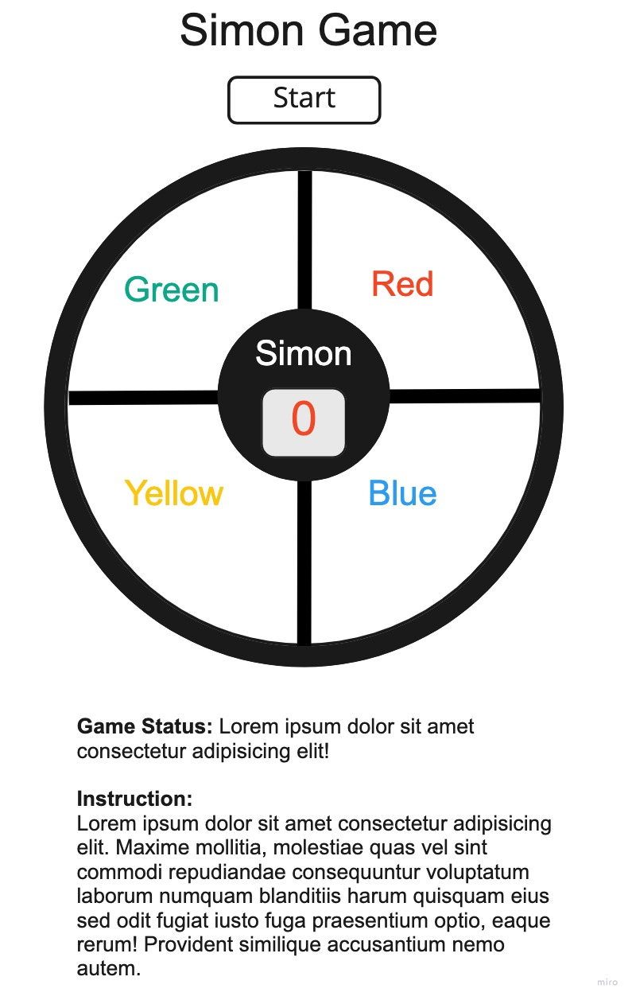

# Project-1-Simon
## **Game Description**
Simon Game is a browser based interactive  memory game.  
- User Interface : The game is played on a round game board with four clickable buttons. Each of the button can light up at a click. 
- Player Object: The player is expected to replicate the sequence of signals that the game board produces. The player wins if he/she reaches the 10th round by successfully replicating the game board's sequence that grows longer by one click each round.

## **Wireframe**
</img>

## **User Stories**

### Game Start
1. A user will click the Start button on top of the game board to start the game.
2. Once the Start button is clicked, the window in the middle of the game board will display 0, which indicates the rounds played.

### Game Play
1. The game board first lights one of the buttons. (Button selection by the game board is random) A player is expected to repeat after the game board by clicking the same button.
2.  When the player successfully replicates the initial sequence the round display window will display 1 to indicate that the player succeeded the first round.
3. The game board will then duplicate the previous sequence and increase the length of sequence by one additional click.
4. The player replicates the sequence and the game round increases by one.
5. The cycle will repeat until the sequence reaches the length of 10 consecutive clicks. (10th round)

### Win Scenario
1. The player wins if he/she reaches the 10th round by exactly replicating the sequences that the game board produces.
2. When user wins the game, game is terminated and winning message is displayed.

### Lose Scenario
1.  The player loses if he/she makes mistake in replicating the sequence 
2. Upon making mistake, the game round display resets to 0 and the game status message informs the player that the he/she lost the game.

## **MVP Goals**
- A user can see game sequences expressed in four different colors.(Colors will be highlighted when selected.)
- A user can use a mouse to click the buttons to replicate sequences.(Colors will be highlighted when selected.)
- A user can see the game round and game status information that gets updated according to the game play.

## **Stretch Goals**
- A timer displays time elapse for a given round and resets when a new round starts.
- A player loses if he/she takes more than 10 seconds to replicate the sequence.
- A user will hear tones that are associated to colors as he/she clicks.
- Once the Start button is clicked, the four buttons of the game board will  take color in order with an associated tone: (clockwise order) Red >> Blue >> Yellow >> Green

