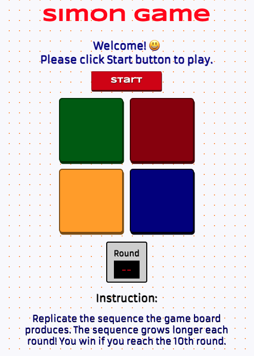

# Simon Game
## **Game Description**
Simon Game is a browser based interactive  memory game.  
- User Interface : The game is played on a game board with four clickable buttons. Each of the button can light up at a click. 
- Player Object: A player is expected to replicate the sequence of signals that the game board produces. The player wins if he/she reaches the 10th round by successfully replicating the game board's sequence that grows longer by one click each round.

## **App Screenshots**
</img>

## **Technologies Used**
- JavaScript
- CSS
- HTML
- Visual Studio Code
- GitHub
- Google Chrome

## **Getting Started:**
1. Install Visual Studio Code
2. Install Live Server Extension in Visual Studio Code
3. Fork and clone the following repository: https://github.com/SKim0523/Project-1-Simon.git
4. Open the index.html file in Visual Studio Code
5. Open the game on Google Chrome browser by clicking the “Go Live” option (bottom right of Visual Studio Code screen)

## **User Stories**

### Game Start
1. A user will click the Start button on top of the game board to start the game.
2. The Round window below the game board initially displays --. This window displays rounds played as the game progresses.

### Game Play
1. The game board first lights a random button. A player is expected to repeat after the game board by clicking the same button.
2. When the player successfully replicates the initial sequence the round display window will display 1 to indicate that the player succeeded the first round.
3. The game board will then duplicate the previous sequence and increase the length of the sequence by one additional click.
4. The player replicates the sequence and the game round increases by one.
5. The above cycle will repeat until the sequence reaches the length of 10 consecutive clicks (10th round).

### Win Scenario
1. The player wins if he/she reaches the 10th round by exactly replicating the sequences that the game board produces.
2. When the player wins the game, game is terminated and a winning message is displayed.

### Lose Scenario
1. The player loses as soon as he/she makes mistake in replicating the gameboard sequence. 
2. Upon making mistake, the game status message informs the player that the he/she lost the game.

## **MVP Goals**
- A user can see game sequences expressed in four different colors.(Colors will be highlighted when selected.)
- A user can use a mouse to click the buttons to replicate sequences.(Colors will be highlighted when selected.)
- A user can see the game round and game status information that gets updated according to the game play.
- A user will hear sounds that are associated to buttons as he/she clicks.
- A user will hear sounds that are associated to win/lose.

## **Unsolved Problems and Challenges**

## ** Next Steps**
I would like to enhance the game with the following added features:
- A timer displays time elapse for a given round and resets when a new round starts.
- A player loses if he/she takes more than 10 seconds to replicate the sequence.
- Once the Start button is clicked, the four buttons of the game board will  take color in order with an associated tone: (clockwise order) Red >> Blue >> Yellow >> Green